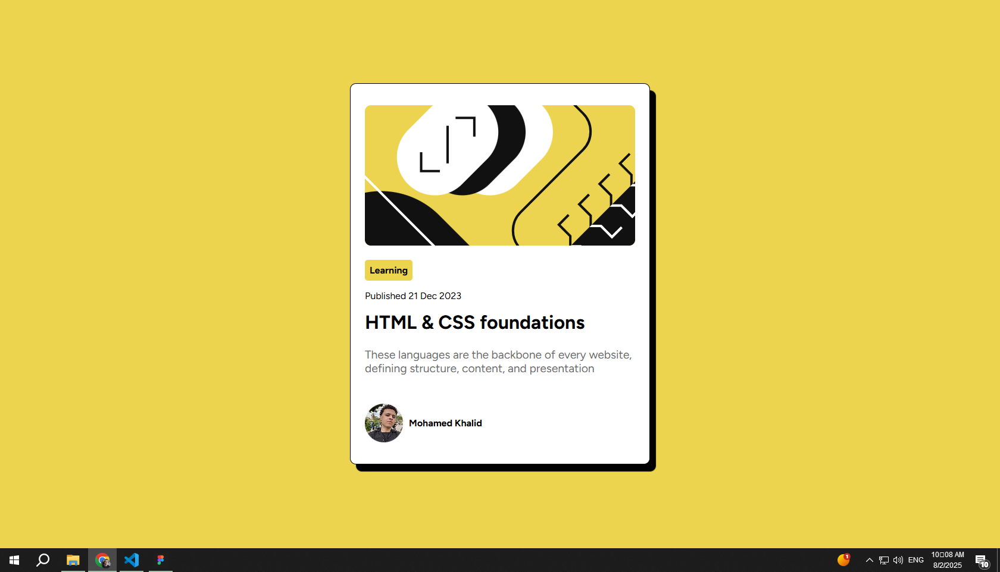

# Frontend Mentor - Blog preview card solution

This is a solution to the [Blog preview card challenge on Frontend Mentor](https://www.frontendmentor.io/challenges/blog-preview-card-ckPaj01IcS). Frontend Mentor challenges help you improve your coding skills by building realistic projects. 

## Table of contents

- [Overview](#overview)
  - [The challenge](#the-challenge)
  - [Screenshot](#screenshot)
  - [Links](#links)
- [My process](#my-process)
  - [Built with](#built-with)
  - [What I learned](#what-i-learned)
  - [Continued development](#continued-development)
  - [Useful resources](#useful-resources)
- [Author](#author)
- [Acknowledgments](#acknowledgments)

**Note: Delete this note and update the table of contents based on what sections you keep.**

## Overview

### The challenge

Users should be able to:

- See hover and focus states for all interactive elements on the page

### Screenshot




### Links

- Solution URL: [Add solution URL here](https://your-solution-url.com)
- Live Site URL: [Add live site URL here](https://your-live-site-url.com)

## My process

### Built with

- Semantic HTML5 markup
- CSS custom properties
- Flexbox
- Mobile-first workflow


### What I learned

i now understand how to:

Structure an article using semantic HTML tags.

Use the <time> element correctly.

Apply headings and paragraphs with meaningful class names.

Import and apply custom fonts in CSS using @font-face.

To see how you can add code snippets, see below:

```html
<article>
    <h4 class="label">Learning</h4>
    <p class="date">Published <time datetime="21">21</time> Dec <time datetime="2023">2023</time></p>

    <h1 class="title">HTML & CSS foundations</h1>
    <p class="caption">These languages are the backbone of every website, defining structure, content, and presentation</p>
  </article>
```
```css
@font-face {
    font-family: figtreeFont ;
    src: url(./assets//fonts/Figtree-VariableFont_wght.ttf);
}

@font-face {
    font-family: figtreeFontitalic ;
    src: url(./assets//fonts/Figtree-Italic-VariableFont_wght.ttf);
}
```


### Continued development

I'm currently focusing on improving my front-end development skills by building more real-world projects. I’m working on becoming more confident with:

Responsive web design

Advanced CSS techniques (Flexbox, Grid, animations)

JavaScript fundamentals

Working with design systems and UI libraries

I also plan to start learning popular JavaScript frameworks like React to build more dynamic and interactive user interfaces.

### Useful resources

- [CSS use custom font (ttf) from folder](https://stackoverflow.com/questions/42561688/css-use-custom-font-ttf-from-folder) - This helped me for import the font in css file 


## Author

- Frontend Mentor - [@Mohamed1khaled2](https://www.frontendmentor.io/profile/@Mohamed1khaled2)
- X - [Mohamed Khaled](https://x.com/mada_555)